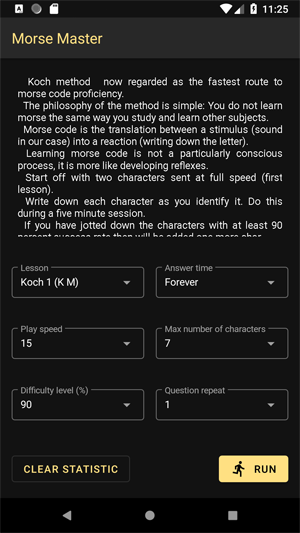
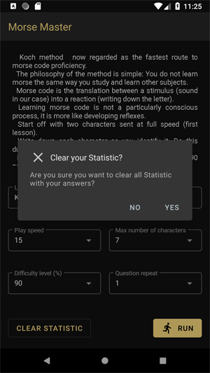
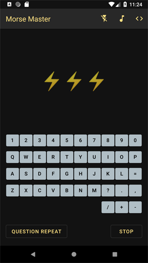
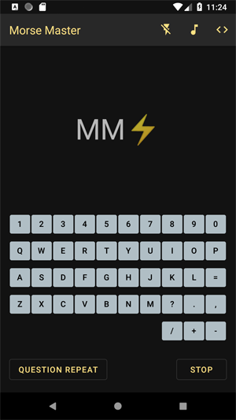

# MorseMaster
Android impl for MorseMaster desktop app (in process) 
 
Setting activity 

 
 
Morse activity - play sound or flash or sound&flash 

 
 
Tips "<>" On 

Статья про приложение Морзе для часов - идеи для развития проекта 
https://medium.com/huawei-developers/harmonyos-lite-wearable-morse-app-b6c28eeadc8f
